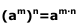

# Conceptos
- [Numeros naturales](#Numeros-naturales)

- [Orden de números](#Orden-de-números)

- [Operaciones basicas](#Operaciones-basicas)

- [Jerarquía de las operaciones](#Jerarquía-de-las-operaciones)

- [Ejercicios 1](#Ejercicios-1)
- [Potencias](#Potencias)
- [Ejercicios 2](#Ejercicios-2)
- []

## Numeros naturales

Bueno, nosotros (los seres humanos) usamos un sistema de numeración decimal eso quiere decir
Contamos del 0 al 9 <- 10 numeros. Mediante la unión de esos simbolos formamos cualquier
numero, eso es el sistema. 0,1,2,3,4,5,6,7,8,9

## Orden de números

Consiste en identificar q número va antes y cual después eso se le de izquierda
a derecha.  Para eso usamos:

## Operaciones basicas

Sumas, restas, multiplicaciones, divisiones. Estas son operaciones basicas que se pueden 
encontrar en cualquier lugar del mundo, pregunta a alguien o investiga

## Jerarquía de las operaciones

El orden en el que se realizan las operaciones es el siguiente:

1º Operaciones que se encuentren entre parentesis.
2º Multiplicaciones y divisiones aunque hayan otros calculos entre ellos.
3º Sumas y restas.

> [!NOTE]
> Si solo hubiera multiplicaciones y divisiones o solo hubiera sumas y restas se realizarán de 
izquierda a derecha.

Otras propiedades pueden ser:

- Sumar un numero con 0 da el mismo numero

- Multiplicar por 1 da el mismo numero por el que se ha multiplicado

- Existencia de la propiedad distributiva (distribuir o unificar 
las operaciones para hacerla más sencilla)

- Multiplicar por 0 da 0

### Ejercicios 1

## Potencias

Consiste en abreviar la forma en la que se representa una multiplicacion del mismo numero.
Ejemplo: Si quisieramos representar  2 x 2 x 2 x 2 es más sencillo representarlo asi:

<h2>Las propiedades de las potencias son las siguientes:</h2>

- Producto con la misma base:  

- Cociente con la misma base:  

- Potencia de una potencia:  

- Producto y el mismo exponente:  

- Cociente y el mismo exponente:  

- Expontente 0:  

- Exponente 1:  

### Ejercicios 2

