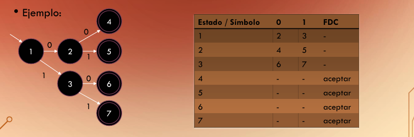

# Indice
- [Lenguajes y Gramáticas Regulares](#Lenguajes-y-Gramáticas-Regulares)
- [Autómata Finito Determinista](#Autómata-Finito-Determinista)
- [Autómata Finito Determinista Complemento](#Autómata-Finito-Determinista-Complemento)

## Lenguajes y Gramáticas Regulares
Para la representación de dichos lenguajes regulares se pueden expresar mediante expresiones regulares:
- $"+"$ significa repetición de `[1,n]`
- $"*"$ significa repetición de `[0,m]`
> [!NOTE]
> Hay que tener en cuenta que se pone $n$ o $m$ al igual que se podría poner cualquier otro símbolo pero debe de estar contenido en el conjunto del que hablemos.

$m, n ∈ \mathbb{N}$

Ejemplo:
$$
L = {a(ab)⁺}, L = {01*}
$$

El primero quiere decir que pertenecen al lenguaje (L) `todas las cadenas` que empiecen por una `a` y contengan `ab` *al menos una vez*.

El segundo lo que dice es que pertenecen al lenguaje `todas las cadenas` que empiecen con `0` y que contengan `1's si se quiere`

Las gramaticas regulares de tipo 3 tienen las siguientes formas:

$S ⟶ aA$

$S ⟶ Aa$

$S ⟶ a$

Esto quiere decir que los estados finales son las a minusculas y las A's mayusculas con no finales.

Imaginemos lo siguiente:

$S ⟶ aA$

$A ⟶ ab | abA$

Podriamos realizar intercambios de la `A` mayuscula ya que no es final hasta dejarlo asi: `"aab"` o asi `"aabababab"`. Al final el objetivo es dejar solo simbolos finales.

## Autómata Finito Determinista

Los autómatas se diseñan con círculos (estados) y flechas (transiciónes).

Los doble circulos (un circulo dentro de otro) indica que es un estado final. Y los que no son estados no finales.

En los autómatas finitos deterministas, cada estado tiene una única transición para cada símbolo terminal.

Reconoce un lenguaje regular.

Formalmente seria una conjunto $ M $
con la siguiente forma:

$M = (𝐐, Σ, 𝛅, q₀, F)$
Donde:
- 𝐐 es el conjunto de estados
- Σ es el alfabeto
- 𝛅 función de transición que toma un estado y un  simbolo terminal y nos devuelve otro.
- q₀ estado inicial
- F conjunto de estados finales.

Los autómatas estan formados por dos partes:
- Un **estado interno** el cual no observamos.
- Una **cinta con la cadena de símbolos de entrada**, ilimitada por la derecha. Y se va leyendo de izquierda a derecha.

Lo que realiza el autómata es una lectura de cada simbolo de la cinta (uno por uno) y si el estado actual en el que se encuentre tiene una transición para dicho símbolo entonces pasa al siguiente estado.
Esto lo realiza hasta leer la cinta completa y si ha conseguido llegar a un estado final el autómata lo reconoce y acepta la cadena como parte de dicho lenguaje. En caso contrario la rechaza y **NO** pertenece al lenguaje.

En la tabla de arriba lo que se muestra es:
- Estado en el que te encuentras
- Con el valor indicado a donde va
- FDC = Final de cadena y si es aceptado o no en dicho estado

## Autómata Finito Determinista Complemento

El AFD complemento de un lenguaje es el que contiene todas aquellas palabras que no contiene el lenguaje original. El complemento del lenguaje $ Α  $ es
$ \overline{A} $

Para su construcción lo único que hay que hacer es convertir los estados finales en no finales y los no finales en finales:

