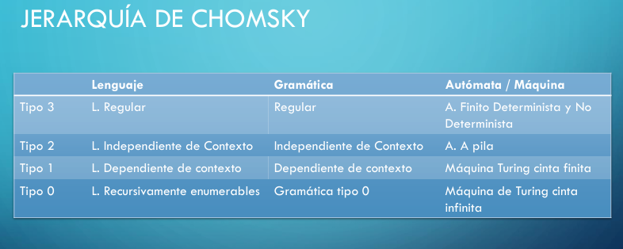
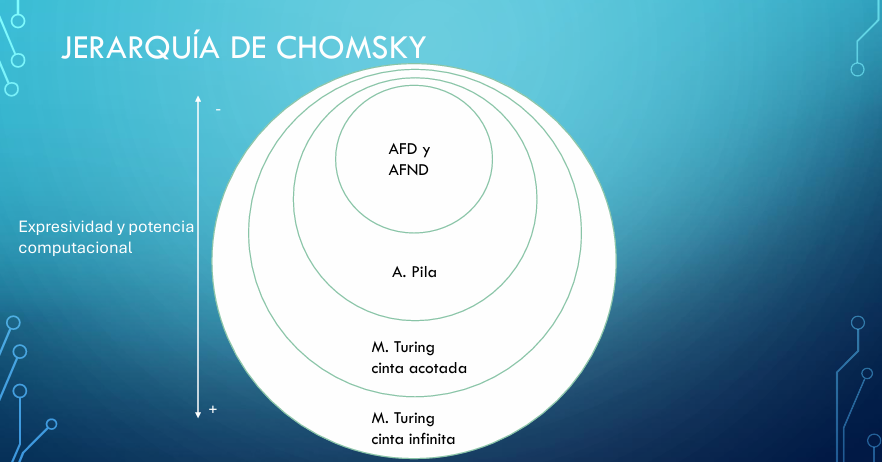

## Jerarquia de Chomsky
    La jerarquía de Chomsky es una clasificación
    jerárquica de distintos tipos de gramáticas formales
    que generan lenguajes formales. Se pueden clasificar
    en 4 tipos:
- Tipo 3:

    ***Lenguaje Regular*** con una **gramática Regular** y los autómatas o maquinas que lo manejan son los **Autómatas finitos deterministas y no deterministras**
- Tipo 2:

    ***Lenguaje Independiente del Contexto*** con una **gramática Independiente del Contexto** y los autómatas o maquinas que lo manejan son los **Autómatas a pila.**
- Tipo 1:

    ***Lenguaje Dependiente del Contexto*** con una **gramática Dependiente del Contexto** y los autómatas o maquinas que lo manejan son las **Máquinas de Turing de cinta finita**
- Tipo 0:

    ***Lenguaje Recursivamente Enumerables*** con una **gramática de tipo 0** y los autómatas o maquinas que lo manejan son las **Máquinas de Turing de cinta infinita**

> Otra forma de verlo sería asi:
    
    
> O también:
    

