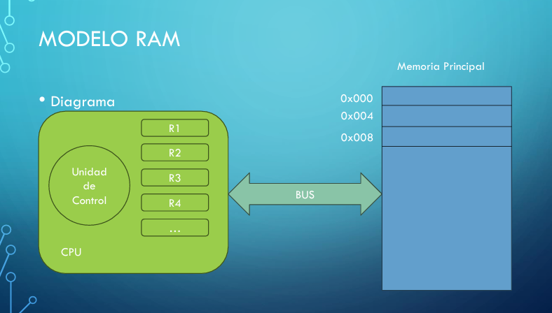
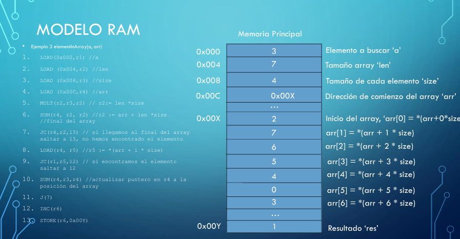

# Modelo RAM

Es un modelo donde tenemos una memoria principal que contiene los datos del programa y los registros que se utilizan para las operaciones.

Este es el modelo **Register-to-register**. Todas las operaciones se hacen mediante registros, ya sean: operaciones aritméticas, saltos condicionales, comparaciones, etc.

> Estos registros estan guardados en una caja llamada memoria.

A la memoria solo se puede acceder mediante dos instrucciones:
 - LOAD = traer/cargar
 - STORE = guardar

Cuando trabajamos con RAM *asumimos que nos dan el programa correctamente cargado para ejecutarse y solo debemos de preocuparnos por manejar el control del flujo del programa.*

La memoria **SOLO** guarda valores numéricos y al inicio **todos los registros contienen 0 por simplicidad**

`El diagrama es lo que realizamos nosotros usando LOAD y STORE con los datos de la memoria principal.
Toda la información de los registros nos lo llevamos a nuestra unidad de control: (R1, R2, ...) y las trabajamos como queramos`

- Las instrucciones que podemos usar son las siguientes:
    - INC(r1): r1 + 1 → r1
    - DEC(r1): r1 - 1 → r1
    - SUM(r1,r2,r3): r1 + r2 → r3
    - MULT(r1,r2,r3): r1 * r2 → r3
    - REST(r1,r2,r3): r1 - r2 → r3
    - DIV(r1,r2,r3): r1 / r2 → r3
    - J(i) → Salto a $X$ linea
    - JC(n, m, i): Salto condicional. $Si n = m va a i$ si no a la siguiente linea
    - JGTZ(n,i): Salto condicional. $Si n > 0$ va a i si no sigue a la siguiente linea
    - LOAD(dir, r1): *dir → r1 ⟶ $Cargar el registro en r1$
    - STORE(r1, dir): r1 -> *dir ⟶ $Cargar lo del registro en dir$

